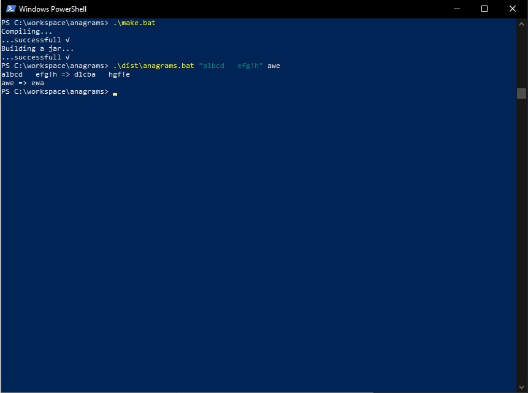
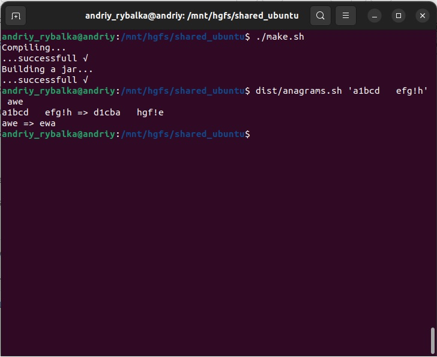
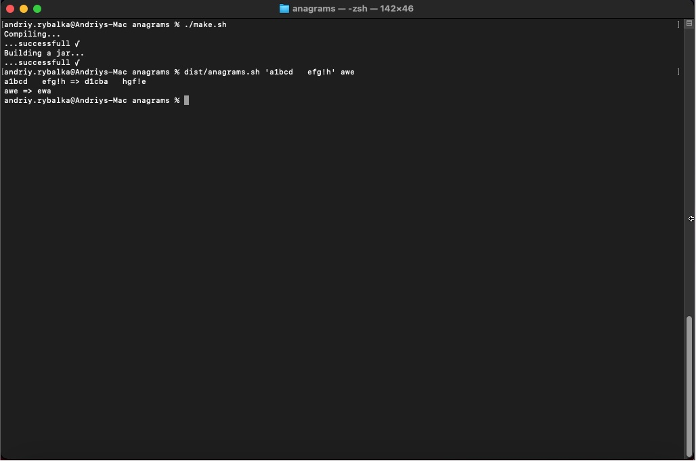
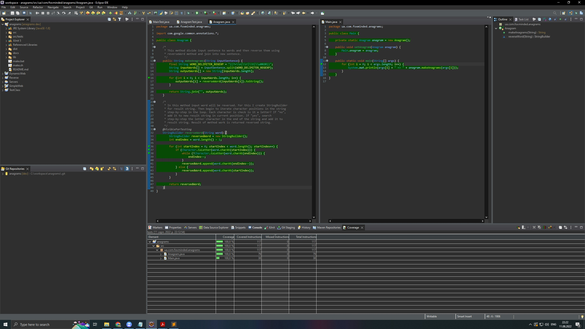
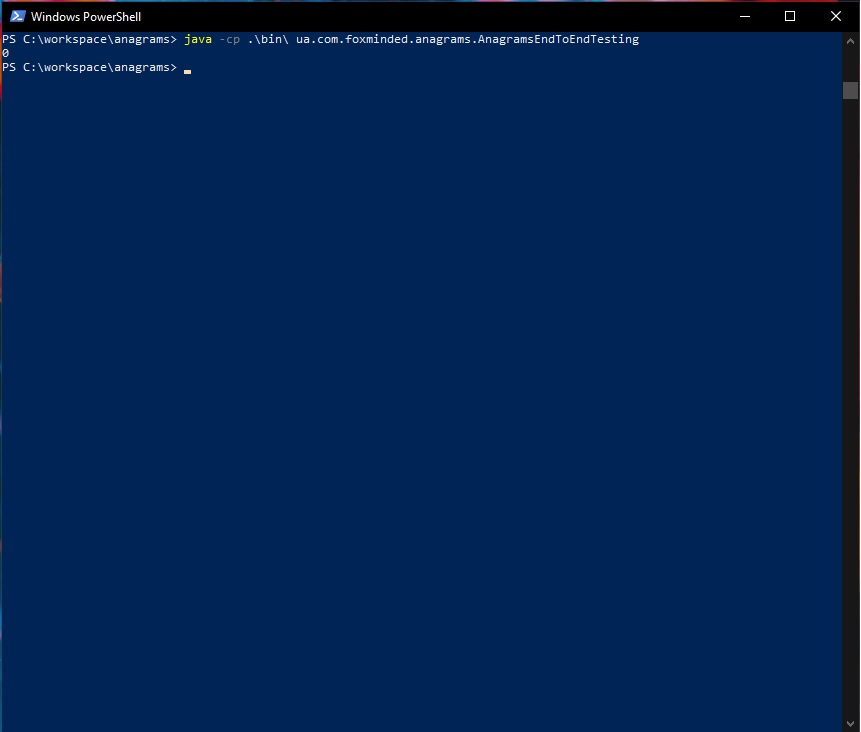

**Anagrams**

  The application that reverses all the words of input text:
  
    "abcd efgh" => "dcba hgfe"

  All non-letter symbols should stay on the same places:

    "a1bcd efg!h" => "d1cba hgf!e"

  Use Latin alphabet for test only.

  Provide `make` for compiling and building jar distributive and `anagrams` for running the program jar. The program will be run from a terminal/command prompt as e.g. `anagrams hel1o w0rlD` or `anagrams "hel  1o w0rlD   "`. It supports Windows 10+, Ubuntu 20.04+, and Mac OS machines. The launch scripts together with the JAR into `dist/` directory. So when the project is cloned the dist contains launch scripts, after that and before the actual distribution the make script must be executed.

## Screenshots











## Java version

**18.0.2.1**

## JDK download
Windows x64: [here](https://www.oracle.com/java/technologies/downloads/#jdk18-windows)

Linux x64 (Compressed Archive): [here](https://www.oracle.com/java/technologies/downloads/#jdk18-linux)

MacOS: [here](https://www.oracle.com/java/technologies/downloads/#jdk18-mac)

## How to run

**Compiling:**

*Windows*
```bash
$\anagrams> .\make.bat
```

*Linux or MacOS*
```bash
$\anagrams> ./make.sh
```


**Running:**

*Windows*
```bash
$\anagrams> \dist\anagrams.bat "a1bcd efg!h" awe
```

*Linux or MacOS*
```bash
$\anagrams> /dist/anagrams.sh "a1bcd efg!h" awe
```
